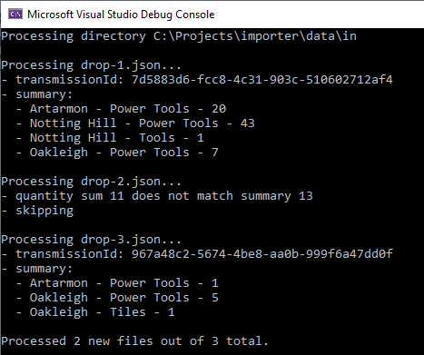
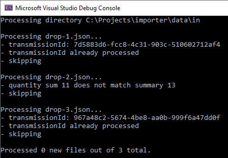

## Few questions to address

1. What database should be used? MS SQL, MySQL, PostgreSQL, etc.
2. What to do with invalid data files? Move to destination folder, keep in source folder, etc.
3. What if destination folder already has processed file? Override, create unique file name, etc.
4. Do we expect data files to be valid in terms of structure?
5. Should we use ORM and create data migration or simple schema.sql will be enough?

## This solution

1. Docker image requires 2 volumes to be mounted with input data files and folder for output
2. These folders to be set as environment variables SRC and DST respectively
3. Database (Postgres) connection parameters are set with environment variables DB_HOST, DB_USER, DB_PASS and DB_NAME
4. Database schema is available in [schema.sql](schema.sql) file
5. Unit tests are coming soon...

## Results

First run will process valid files and moves all files from source to destination folder.

Let's move data files back to source folder and run app again.

## Docker

Docker image is available at [dyakhnov/importer](https://hub.docker.com/r/dyakhnov/importer)
